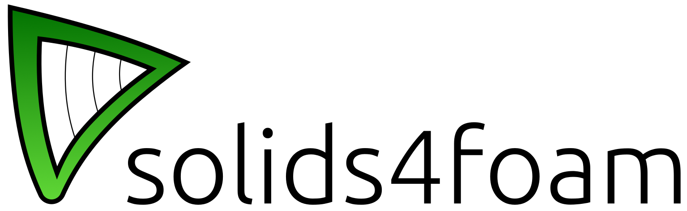

---

## Overview

### What is solids4foam?

solids4foam is a toolbox for performing solid mechanics and fluid-solid interactions in OpenFOAM.

### What is this fork?

This fork reprensents an extension of solids4foam to incorporate various to incorporate various damage and fracture mechancis models coupled with both linear (small-strain) elastic, elasto-plastic and non-linear (large strain) elasto-plastic models to characterise the deformation.

##  Material Models
The following material models are given:

### Small-strain laws

1. Neo-hookean elasto-plastic with Lemaitre damage (linearLemaitreDamage)
2. Small-strain Gurson-Tvergaard-Needleman micro-mechanical damage model
3.  Neo-hookean elasto-plastic with phase field fracture
4.  Linear elasticicity with phase field fracture

### Large-strain models
1. Large strain elasto-plasticity (Green strain) with Lemaitre damage
2. Large strain logarithmic strain with Lemaitre damage
3. Large strain logarithmic strain with Lemaitre damage and crack-closure effects
4.  Large strain logarithmic strain with Lemaitre damage and a developed effective non-local damage procedure
5. Large strain logarithmic strain with the  Gurson-Tvergaard-Needleman micro-mechanical model
6.   Large strain logarithmic strain with phase-field fracture

## Tutorial Cases

### Lemaitre model
1. Notched round bar
2.  One element

### GTN model
1. Notched round bar
2.  One element

### Phase-field model

1. Flat notched bar
2.  One element
