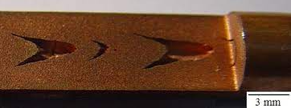

---

## Overview

### What is solids4foam?

solids4foam is a toolbox for performing solid mechanics and fluid-solid interactions in OpenFOAM.

### What is this fork?

This fork reprensents an extension of solids4foam to incorporate various state of the art damage and fracture mechanics models. These models are coupled with both linear (small-strain) elastic, elasto-plastic and non-linear (large strain) elasto-plastic models to characterise the deformation. The damage and fracture models developed and implemented are based on the following frameworks: 

1. Lemaitre damage model (Continuum damage mechanics)
2. Gurson-Tvergaard-Needleman (micro-mechanical damage model)
3. Phase-field fracture model

For review of state of the art in damage and fracture modelling see the following papers:
1. Trong Son Cao (2017) - Doi:  10.1007/s12289-015-1262-7.
2. Tekkaya et al. (2020) - Doi: 10.1016/j.cirp.2020.05.005.
3. Wu et al. (2020) - Doi: 10.1016/bs.aams.2019.08.001
4. Borden et al. (2016) - Doi:  10.1016/j.cma.2016.09.005.

The elastic and elasto-plastic models used to characteriste the deformation are as follows:
1. Neo-hookean linear-elasticity
2. Neo-hookean elaticity with von Mises plastictiy - seperate approaches to characterise the deformation using the strain ratio (Greeen strain) and the logarithmic strain have been utilised

For more information on these deformation models see the following textbooks:
1. Simo & Hughes (1998) - ISBN: 978-0-387-97520-7.
2. de Souza Neto et al. (2008) - ISBN:  978-0-470-69462-6 978-0-470-69452-7

Note: unlike main version of solids4Foam this fork is not compatible with the OpenFOAM versions: OpenFOAM-v2012 (OpenFOAM.com) and OpenFOAM-9

### Where do I start?

Please visit the [solids4foam website](https://solids4foam.github.io).

### Disclaimer

This offering is not approved or endorsed by OpenCFD Limited, producer and distributor of the OpenFOAM software via [www.openfoam.com](https://www.openfoam.com), and owner of the OPENFOAM® and OpenCFD® trade marks.

### Acknowledgement

OPENFOAM® is a registered trademark of OpenCFD Limited, producer and distributor of the OpenFOAM software via [www.openfoam.com](https://www.openfoam.com).

## Example Results:
- Accurate prediction of chevron-cracking (internal cracks) in the wire drawing process. Images shown are the computational simulation (270 degrees of the wire is shown here in order to display the internal cracking), a schematic and experimentally observed internal cracking:

  
  &nbsp &nbsp &nbsp &nbsp &nbsp
  
   &nbsp &nbsp &nbsp &nbsp &nbsp
  

- Necking and rapid crack propogation for a round bar undergoing a tensile test. The computational simulation (half of the specimen is modelled here due to symmetries), a schematic and experimentally observed necking and fracture are shown:

   
  
  
   &nbsp &nbsp &nbsp &nbsp &nbsp &nbsp &nbsp &nbsp &nbsp
  

##  Material Models
Additional material models given in this fork are:

### Small-strain laws

1. Neo-hookean elasto-plasticity with Lemaitre damage 
2. Small-strain Gurson-Tvergaard-Needleman (GTN) micro-mechanical damage model
3. Neo-hookean elasto-plastic with phase field fracture
4. Linear elasticicity with phase field fracture

### Large-strain models
1. Large strain elasto-plasticity (Green strain) with Lemaitre damage
2. Large strain logarithmic strain with Lemaitre damage
3. Large strain logarithmic strain with Lemaitre damage and crack-closure effects
4. Large strain logarithmic strain with Lemaitre damage and a developed effective non-local damage procedure
5. Large strain logarithmic strain with the Gurson-Tvergaard-Needleman micro-mechanical model
6. Large strain logarithmic strain with phase-field fracture

For user guide on these models see their associated .h files

(e.g.  `./src/solids4FoamModels/materialModels/mechanicalModel/mechanicalLaws/nonLinearGeometryLaws/logStrainLemaitreCrackClosure/logStrainLemaitreCrackClosure.h`)

## Tutorial Cases

### Lemaitre model 
`.tutorials/solids/Lemaitre`
1. Notched round bar
2. One element

### GTN model 
`.tutorials/solids/GTN`
1. Notched round bar
2. One element

### Phase-field model
`.tutorials/solids/phaseFieldFracture`
1. Flat notched bar
2. One element
